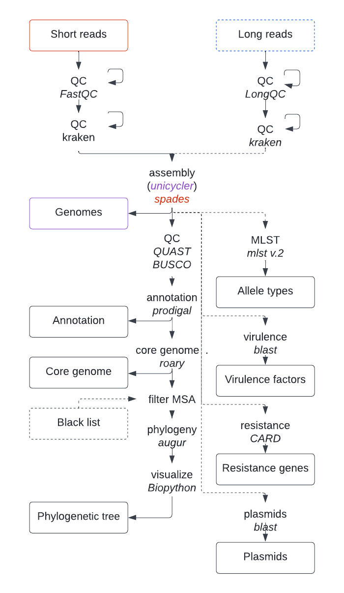
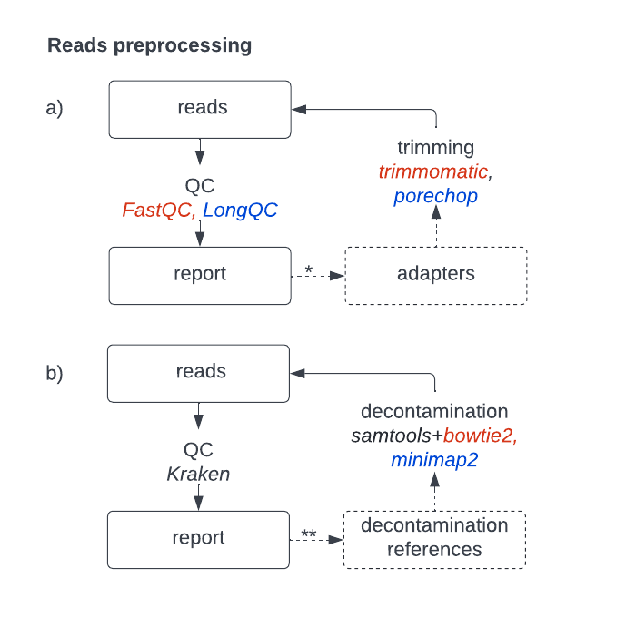

# Sustainable Workflow for Hybrid Bacterial Genome Assembly and  Analysis
Final project for the course Applied Sequence Analysis 

Myrthe Willemsen & Dana Barilan 

22nd of July 2022

-------------------------------------------------------

## Project outline
Here we suggest a hybrid approach for bacterial genome assembly, joining the strengths of both long and short reads. We subsequently show how downstream analyses can extract useful functional and evolutionary information from the assembled genomes, by means of multiple sequence alignment, phylogenetic inference, multi locus sequence typing, and a comprehensive annotation of genes, virulence factors, antibiotic resistance genes and plasmids.  
A generalized pipeline is implemented in Snakemake to allow for reproducbitility, adaptablility and transparancy. 

## Dependencies 
To run the pipeline, conda and snakemake need to be installed. Refer to the websites of [Snakemake](https://snakemake.readthedocs.io/en/stable/) and [Anaconda](https://www.anaconda.com/) for installation manuals. Further dependencies will be downloaded and installed automatically through the shipped conda environments. 

## Working with snakemake 
After downloading and unzipping or cloning this repository, the pipeline can be run from the downloaded directory `asa-finalProject` by setting your available number of cores: 
```bash
snakemake --cores 8 --use-conda
```  
The main function `rule all` in the Snakefile under the workflow directory is called automatically upon running snakemake. To tailor the pipeline to your needs, please refer to the [optional steps]() that can be set in the configuration file. It is also possible to run the pipeline up until a certain rule. Please refer to the [Snakemake tutorial](https://snakemake.readthedocs.io/en/stable/tutorial/tutorial.html) for more information. 

-------------------------------------------------------

## Configuration file 
The configuration file `config.yaml` can be found under the `config` directory, and can be used to add direcotry paths, to in or exclude optional steps, and to change parameters. All settings are set to their default values as were used in our sample workflow.     

### Directories
- **Samples**: A tab seperated table (.tsv) should be provided listing the sample IDs, and the paths to the short reads (for both paired-ends), and if available and inclued in the workflow, the path to the long reads. Both datatypes should be FASTQ. We assume Illumina short reads and Oxford Nanopore (ONT) long reads. 
Please **note** that incorrect use of tabs will result in an error. The default path is set to `resources/samples.tsv` and can be changed in the config file. 
Further **note** that the sample IDs should not contain a slash "\"!
- **Contamination references**: Contamination references can be provided for the long and/or short reads, that will be used if the respective decontamination step is set to True. It is recommended to create the references based on the screening results. By default the refrerences are expected in `resources/references/contamination_long.fasta`.
- **Virulence database**: If the virulence analysis step is set to True, a path can be provided to the database with virulence factors. If no path is provided, the VF core DNA database will be downloaded and build automatically, which is the default case. 
- **Plasmids database**: If the plasmid analysis step is set to True, a path can be provided to the database with reference plasmids. If no path is provided, the PLSDB database will be downloaded and build automatically, which is the default case. 
- **Kraken database**: If screening for either long or short reads is set to true, a Kraken database should be provided. By default this is under the directory `resources/kraken_db`
- **Blacklist**: a blacklist file can optionally be provided to mask certain samples for the phylogenetic inference. 
- **Trimming short read adapters**: To cut adapter from short Illumina reads, add the path to the adapter fasta file in the configuration file, under trimmomatic, illuminaclip, file. The default path is `resources/adapters/TruSeq3-PE.fa`. Complete the other illuminaclip values as suits your research. 
See full manual by `trimmomatic` [here](http://www.usadellab.org/cms/uploads/supplementary/Trimmomatic/TrimmomaticManual_V0.32.pdf).

### Optional steps
Each of the optional steps can be set to "True" or "False" to indicate whether the respective step should be performed. 
For each of the preprocessing steps (trimming, screening, decontamination and qc) the user can further specify whether the step should be performed. 
Note that by putting on an optional step might require you to provide an additional directory to a database. 

 

### Parameters 
For most steps in the pipeline it is possible to tailor the parameters to your needs, when using different bacterial sequencing data. 
The parameters can be found under the name of the software used. Some important or compulsorary parameters are explicitly listed under the the toolname, but one can add further optional parameters under `extra`. For each of the tools a link to the user manual with possible optional such parameters is provided. If there are no relevant additional parameters to be set, the option `extra` is not provided in the config file. Please **note** to use correct flags "-", keywords, and allowed argument types, since we do not check for this in the pipeline. Some specific parameters are listed below. 
- **Phylogenetic method**: Algorithm used for infering the phylogeny {fasttree, raxml, iqtree}. We recommand using fasttree if many samples are provided. 
- **Lineage**: If specified path to BUSCO lineage local file, prevent BUSCO searching online with offline: "True"
- **Trimming long read adapters**: To add specific adapter to be removed from the start of the read, add `--start_adapt` followed by your adapter sequence to the configuration file, as the extra configuration. 
For example: `extra = "--start_adapt ACGCTAGCATACGT"`
For more options, see the full manual by `porechop` [here](https://github.com/rrwick/Porechop).

-------------------------------------------------------

## Results
The results can be found under the result directory after running the pipeline. Also intermediate results are present, usually they can be found to facilitate rerunning the pipeline partially. We kindly refer you to the attached report if you want to learn more on how to interpret the results. Furthermore, log files are available under `results/log` for each step in the pipeline. 
- **Assembled genomes**: The assembled genomes can be found as FASTA files under `results/genomes`.
- **Annotations**: The annotations of the genomes can be found as GFF files under `results/annotations`.
- **Quality metrics**: Quality metrics are available under `results/qc`. The preprocessing quality metrics are aggregated for the multiple samples, and so are the quality metrics of assembled genomes. 
- **Downstream analyses**: Results of MLST, plasmid, antibiotic resistance and virulence factor screening are aggregated into csv files and can be found under `results/`. 
- **Core genome**: The core genome, represented as a multiple sequence alignment, can be found as a signle file under `results/pangenome`. 
- **Phylogenetic tree**: The phylogenetic tree can be found und as a .png under `results/tree`.


<!-- 
## Further information on workflow steps  -->
<!-- ### Short reads trimming with `trimmomatic`
To cut adapter from short Illumina reads, add the path to the adapter fasta file in the configuration file, under trimmomatic, illuminaclip, file. The default path is `resources/adapters/TruSeq3-PE.fa`. Complete the other illuminaclip values as suits your research. 
See full manual by `trimmomatic` [here](http://www.usadellab.org/cms/uploads/supplementary/Trimmomatic/TrimmomaticManual_V0.32.pdf).
 -->

<!-- ### ONT trimming with `porechop`
To add specific adapter to be removed from the start of the read, add `--start_adapt` followed by your adapter sequence to the configuration file, as the extra configuration. 
For example: `extra = "--start_adapt ACGCTAGCATACGT"`
For more options, see the full manual by `porechop` [here](https://github.com/rrwick/Porechop).
 -->
